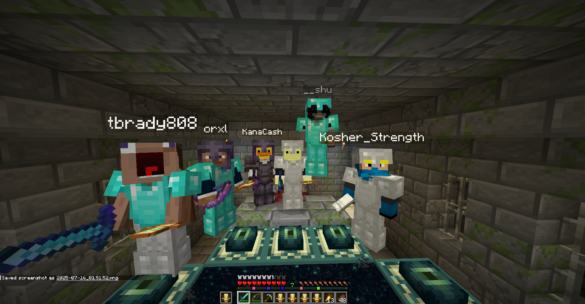

# **Minecraft Server Project**

**Minecraft Server – Multiplayer Setup and Experimentation**

For a while, I’d wanted to try hosting my own Minecraft server instead of just joining someone else’s. Over the break, I decided to turn that idea into a small project. My goal was pretty straightforward: create a multiplayer server that my friends and I could play on, while also learning about networking, server administration, and performance optimization in the process.

---

## **Server Setup**

I started with an old desktop PC I wasn’t using anymore and installed Ubuntu Server on it. After updating and patching everything, I installed the latest version of Java since Minecraft runs on it. From there, I downloaded the official Minecraft server `.jar` file from Mojang.

To make things easy for my friends, I configured a static IP for the machine on my home network and then set up port forwarding on my router for port **25565**, which is the default Minecraft server port. That was my first real learning curve: understanding how port forwarding actually works, making sure it’s secure, and testing it properly so only the right traffic got through.

Once I had the server running, I modified the `server.properties` file to tweak the settings. I changed the world seed, set a whitelist so only invited friends could join, and increased the maximum player count. I also allocated more RAM to the server by editing the startup script, which helped with performance when chunks were loading.

---

## **Experimentation and Testing**

At first, I tested everything locally by connecting to `localhost` on my gaming laptop. Once I confirmed it worked, I invited a few friends to join using my public IP. It was actually pretty satisfying when they connected successfully, and we could all run around in the same world.

I experimented with installing plugins using **PaperMC**, a high-performance fork of the Minecraft server. I tried plugins that added quality-of-life features, like setting homes and warps, and others that helped with server moderation, like anti-griefing tools. Installing these plugins taught me about reading logs carefully, because one typo or incompatible plugin version could crash the whole server.

I also kept an eye on system performance using `htop` and noticed CPU usage spiked when players were exploring new areas. This made me think more about optimizing world generation and maybe pre-loading chunks in the future.

---

## **Experience Gained**

* **Networking Basics**: Learned to configure static IPs and set up port forwarding so the server could be reached from outside my home network.

* **Server Administration**: Installed and configured a Minecraft server, tweaked properties, and managed players with a whitelist.

* **Performance Tuning**: Allocated system resources and monitored usage to understand the impact of plugins and world generation.

* **Plugin Management**: Experimented with PaperMC plugins and learned to troubleshoot crashes and compatibility issues.

