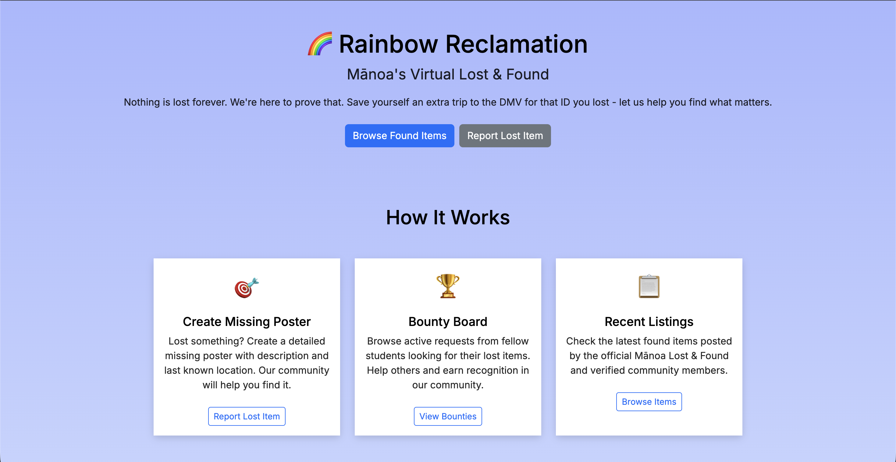

### **Rainbow Reclamation**

**Rainbow Reclamation** is a web application developed for my ICS 314 (Software Engineering) course. Working alongside three other developers, our team set out to redesign and improve UH Mānoa’s existing Lost & Found system with the goal of making it more engaging and user-friendly, ultimately encouraging more people to help return lost items. The application is backed by a database that stores and manages information related to reported lost items.

My primary contributions focused on the front-end and user experience of the site. I worked on refining visual elements across multiple pages, implementing functional redirects, and improving components of the admin dashboard. I also helped develop the login and sign-up functionality and collaborated with my teammates throughout the development process.

Through this project, I gained hands-on experience with the realities of software engineering in a team environment. I learned how to coordinate work based on each team member’s strengths, availability, and coding experience, and I developed a better understanding of why project timelines and early deadlines are essential. One of the most valuable lessons from this project was recognizing how much time and effort is required for testing, debugging, and iterating on features to ensure the application functions as intended while meeting both technical and user-experience goals.

